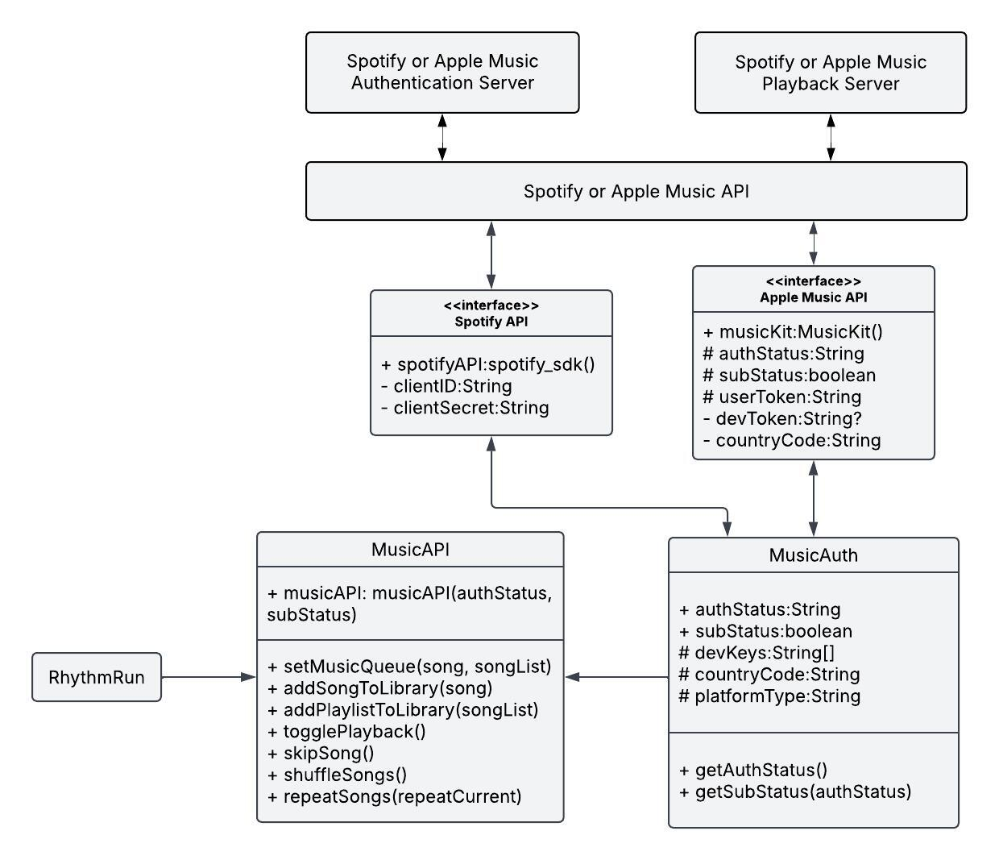

## 1. Introduction

### 1.1. Purpose of the Document

This document identifies functional elements related to the RhythmRun application and describes the implementation of these elements. The element description shall be of sufficient detail to verify design goals and thus serve as the guideline to the implementation of the RhythmRun application. This document also forms the basis for developing test code for the RhythmRun application.

### 1.2. Scope of the Document

This document describes the functionalities that are present in the RhythmRun application. It also describes in detail the various classes that implement these functionalities and the software interfaces associated with this application.

## 2. General Description

### 2.1. Product Goal

The goal of the RhythmRun application is to provide an accessible and engaging structure to running workouts in a way that is both functional and unique.

### 2.2. Development Profile

Developed in the Flutter framework for use on multiple different platforms, mainly using the Dart programming language. OS-specific devices:

- Android
- iOS

### 2.3. Interfaces and Interactions

The app uses various APIs to function:

- Spotify API
- Apple Music API
- HealthKit

### 2.4. Assumptions and Dependencies

The RhythmRun application runs under the assumptions and dependencies laid out in the requirements document.

## 3. System Architecture Overview

### 3.1 Functional Design

Figure 1: RhythmRun Data Schema Diagram

### 3.2 Local Storage

- Methods:
  - **importLocalPlaylist(localPlaylist)**: return import
    - Pre-conditions: localPlaylist contains valid song files
    - Post-conditions: A valid playlist containing imports is returned
  - **importLocalButton()**
    - Pre-conditions: The user has selected a file to import
    - Post-conditions: importLocalPlaylist is called on the file

### 3.3 Spotify API

- Methods:
  - **getAuthenticationToken()**
    - Pre-conditions: Check if the redirect URl and client ID are valid and what appropriate "scope" which is how much does the app access on the user's Spotify account
    - Post-conditions: Returns the authentication token
  - **addToLibrary(trackID)**
    - Pre-conditions: Check if the trackID is a valid URI
    - Post-conditions: Add the track to the user's Spotify library
  - **skipSong()**
    - Pre-conditions: Check if a song is currently playing
    - Post-conditions: Skips to the next song on the user's music queue on Spotify
  - **shuffleSongs()**
    - Pre-conditions: Check if the playlist is already shuffled to toggle it on or off, or just start shuffling if it has not been already shuffled
    - Post-conditions: Shuffles the users playlist on or off depending on the shuffle status
  - **repeatSong()**
    - Pre-conditions: Check if the user wants to repeat the current track, or repeat through the whole playlist or turn repeat off
    - Post-conditions: Toggles the repeat function of Spotify either on loop on one song, or on a playlist
  - **queueSong(trackID)**
    - Pre-conditions: Check if the trackID is a valid URI
    - Post-conditions: Adds the song next in queue to the current playback session

### 3.4 Apple Music API

- Methods:
  - **checkAuthorization(authStatus)**: boolean
    - Pre-conditions: Check if the user has authorized Apple to share data with RhythmRun where auth_status is usually in one of these states: (initialize, denied, not_determined, authorized, or restricted)
    - Post-conditions: Returns a boolean value; true if the user has successfully authorized the application to use the API, and false if the auth_status is not authorized otherwise
  - **setQueue(songs, playlist)**
    - Pre-conditions: Check if the trackID is a valid URI or the trackList is in the correct json format and has valid URIs
    - Post-conditions: Adds the song next in queue to the current playback session
  - **play()**
    - Pre-conditions: Checks if there is no music currently playing
    - Post-conditions: Plays the most recently played song

Figure 2: Music API Schema

### 3.5 Apple Watch

- Methods:
  - **trackHeartRate(workoutSession)**: return heartRate
    - Pre-conditions: Check if the user has authorized using health data, and check if the user is currently in a workout
    - Post-conditions: Returns an integer array or json file of the user's heart rate during the workout with timestamps
  - **syncFromAppleWatch(heartRate)**
    - Pre-conditions: Checks if the json file or integer array from trackHeartRate(workoutSession) is valid
    - Post-conditions: Exports the heart rate data over to Apple Health using HealthKit

### 3.6 Playlist Upload

- Methods:
  - **localImport(str fileLocation)**: Return Import
    - Pre-conditions: file path
    - Post-conditions: the playlist is imported into the app
  - **spotifyImport()**
    - Pre-conditions: Authenticated and authorize the app to access to Spotify account
    - Post-conditions: Spotify playlist is imported into the app
  - **appleImport()**
    - Pre-conditions: The user has authenticated and authorized the app to access their Apple Music account
    - Post-conditions: The selected Apple playlist is imported
  - **importButton()**
    - Pre-conditions: The user has selected a playlist source
    - Post-conditions: A playlist is loaded into the app

### 3.7 BPM Analysis

- Methods:
  - **findStartingBeats(Song song)**: return FormerHalf
    - Pre-conditions: A song file has been loaded
    - Post-conditions: the BPM of the former half of the song is returned
  - **findEndingBeats(Song song)**: return LatterHalf
    - Pre-conditions: A song file has been loaded
    - Post-conditions: the BPM of the latter half of the song is returned
  - **findSongLength(Song song)**: return length
    - Pre-conditions: A song file has been loaded
    - Post-conditions: The song length is returned
  - **findAverageBPM(startingBeats, finalBeats, songLength)**: return BPM
    - Pre-conditions: A song file has been loaded, and beats have been found
    - Post-conditions: Returns average BPM

### 3.8 Experience Levels

- Methods:
  - **askExperienceLevelButton()**
    - Pre-conditions: Ensure the user selects an experience level
    - Post-conditions: 
  - **getAvgPace(expLevel)**: return int/double
    - Pre-conditions: Experience level is selected
    - Post-conditions: returns one pace associated with experience level
  - **askPaceButton()**
    - Pre-conditions: None
    - Post-conditions: returns desired range of paces
  - **calculatePaceIntervals(paceGroup)**: return dict
    - Pre-conditions: Average pace group
    - Post-conditions: returns range of paces from average pace group

### 3.9 Performance Stats

- Methods:
  - **getHeartRate(heartRate)**: return avgHeartRate
    - Pre-conditions: Sensor data to obtain user heart rate
    - Post-conditions: Approximate average heart rate during workout
  - **getDistance(distance)**: return float
    - Pre-conditions: Input user desired length of workout
    - Post-conditions: None
  - **getElevationChange(elevation_change)**: return float
    - Pre-conditions: Smart watch integration with GPS tracking data
    - Post-conditions: None

### 3.10 Song

- Methods:
  - **init(soundFile: soundType)**
    - Pre-conditions: A valid sound file has been loaded
    - Post-conditions: Initializes the length and tempo of the song to be 0

### 3.11 Song Customization

- Methods:
  - **manualTempo(tempPoint, length, double)**
    - Pre-conditions: A song file is loaded
    - Post-conditions: The tempo of the song is manually adjusted
  - **adjustTempo(playlist: Song[])**
    - Pre-conditions: A playlist of songs is provided
    - Post-conditions: The tempos of the songs are adjusted to workout intensity
  - **songTransition(song1: Song, song2: Song)**
    - Pre-conditions: Two valid songs are provided
    - Post-conditions: Transition is applied between the two songs
  - **repeatSong(song: Song)**
    - Pre-conditions: A song is loaded
    - Post-conditions: A song is repeated

### 3.12 Workout

- Methods:
  - **startWorkout()**
    - Pre-conditions: Checks if HealthKit is properly initiated
    - Post-conditions: Starts the workout for HealthKit
  - **endWorkout()**
    - Pre-conditions: Checks if HealthKit is properly initiated and a workout is currently in progress
    - Post-conditions: Returns the distance, running route, duration of the workout, the pace, and the elevation changes

### 3.13 Workout Customization

- Methods:
  - **changeDuration(duration: double)**
    - Pre-conditions: A valid duration of time for the workout
    - Post-conditions: Alter the duration of the workout to what the user wishes
  - **changeDurationButton()**
    - Pre-conditions: changeDuration(duration: double) is properly implemented
    - Post-conditions: changeDuration is called with an appropriate duration
  - **changeLevel(level: double)**
    - Pre-conditions: An experience level for the workout
    - Post-conditions: Change the experience level
  - **changeLevelButton()**
    - Pre-conditions: changeLevel(level: double) is properly implemented
    - Post-conditions: changeLevel is called with an appropriate level

### 3.14 Generate Playlist

- Methods:
  - **generatePlaylist(averageBPM, expLevel, avgPace, paceGroup)**: return Playlist
    - Pre-conditions: The average BPM, experience level, and pace interval that the user wants for his or her playlist
    - Post-conditions: Returns an application-generated playlist with the characteristics that the user requested

### 3.15 Saving Playlist

- Methods:
  - **savePlaylist(playlist)**
    - Pre-conditions: Check if one (and only one) playlist has been chosen for being saved
    - Post-conditions: A saved playlist of the user's choice
  - **deletePlaylist(playlist)**
    - Pre-conditions: Check if one (and only one) playlist has been chosen for deletion
    - Post-conditions: One less playlist in the user's library

## [Link to the Project Requirements v1 PDF](/reports/Design.pdf)
